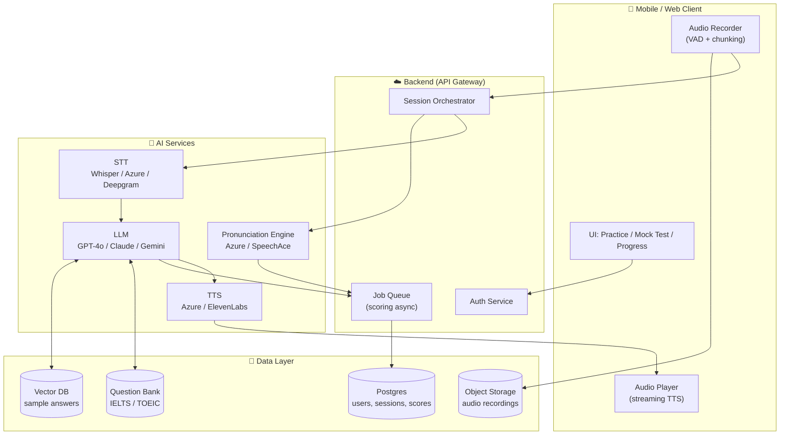
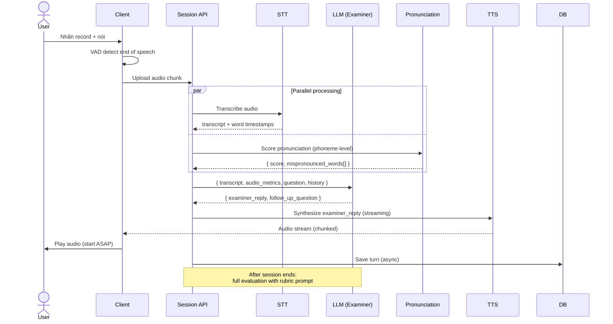

# Speaking App – IELTS/TOEIC: Rubric, Bộ câu hỏi & Kiến trúc MVP

<aside>
🎯

Tài liệu thiết kế cho ứng dụng luyện nói IELTS / TOEIC dành cho học sinh, sinh viên Việt Nam. Bao gồm 3 phần:

1. Rubric chấm điểm IELTS Speaking (prompt cho LLM)
2. Bộ câu hỏi mẫu IELTS Part 1/2/3 và 11 questions TOEIC Speaking
3. Sơ đồ kiến trúc kỹ thuật MVP
</aside>

---

# 1. Rubric chấm điểm IELTS Speaking (prompt cho LLM)

## 1.1. Tổng quan 4 tiêu chí (theo IELTS chính thức)

| Tiêu chí | Trọng số | Đánh giá điều gì |
| --- | --- | --- |
| **Fluency & Coherence (FC)** | 25% | Tốc độ nói, tính liên tục, sự gắn kết ý, dùng linking words |
| **Lexical Resource (LR)** | 25% | Phạm vi từ vựng, độ chính xác, paraphrase, collocations, idioms |
| **Grammatical Range & Accuracy (GRA)** | 25% | Đa dạng cấu trúc, độ chính xác, câu phức |
| **Pronunciation (PR)** | 25% | Âm cá nhân, stress, intonation, rhythm, độ dễ hiểu |

## 1.2. System Prompt mẫu cho LLM chấm điểm

```
You are a certified IELTS Speaking examiner with 10+ years of experience.
Your task: evaluate a candidate's spoken response based on the official
IELTS Speaking band descriptors (public version).

INPUT:
- question: the IELTS question asked
- part: 1, 2, or 3
- transcript: text from STT (may contain minor errors)
- audio_metrics: { wpm, pause_count, filler_count, pronunciation_score }

OUTPUT (strict JSON, no prose outside):
{
  "fluency_coherence": {
    "band": <number 1.0-9.0, in 0.5 steps>,
    "strengths": ["..."],
    "weaknesses": ["..."],
    "evidence": ["quote from transcript"]
  },
  "lexical_resource": { same shape },
  "grammatical_range": { same shape },
  "pronunciation": { same shape, use audio_metrics },
  "overall_band": <average rounded to nearest 0.5>,
  "improved_answer": "a band 7.5+ rewrite of the candidate's answer, keeping their ideas",
  "key_corrections": [
    { "original": "...", "corrected": "...", "reason": "..." }
  ],
  "vocab_upgrades": [
    { "original": "good", "upgrade": "remarkable", "context": "..." }
  ],
  "feedback_vi": "Phản hồi ngắn gọn bằng tiếng Việt, 3-4 câu, khích lệ"
}

RULES:
- Be strict but fair. Do NOT inflate bands.
- Quote evidence directly from transcript.
- For Part 2, penalize if response < 90 seconds.
- For Part 3, expect extended, abstract answers.
- Never give band 9 unless truly native-like.
```

## 1.3. Mô tả ngắn gọn từng band (cheatsheet)

- **Band 9 – Expert**
    
    Nói lưu loát hoàn toàn, hiếm khi dừng để tìm từ. Từ vựng, ngữ pháp tự nhiên như native. Phát âm rõ ràng, có ngữ điệu tinh tế.
    
- **Band 7 – Good user**
    
    Nói liên tục với ít do dự. Dùng được linking words đa dạng. Có một số collocations và idiom. Câu phức đa dạng nhưng còn lỗi nhỏ. Phát âm dễ hiểu, có một vài âm sai.
    
- **Band 6 – Competent user**
    
    Nói khá liên tục nhưng đôi khi mất mạch. Từ vựng đủ để diễn đạt nhưng còn lặp. Cấu trúc đơn giản chiếm đa số. Phát âm có thể hiểu được nhưng lỗi rõ.
    
- **Band 5 – Modest user**
    
    Nói chậm, dừng nhiều, lặp từ. Vốn từ giới hạn. Lỗi ngữ pháp thường xuyên. Phát âm gây khó nghe ở một số đoạn.
    
- **Band 4 – Limited user**
    
    Dừng rất nhiều, mất mạch. Từ vựng cơ bản. Câu đơn ngắn, nhiều lỗi. Phát âm gây hiểu lầm nhiều chỗ.
    

---

# 2. Bộ câu hỏi mẫu

## 2.1. IELTS Speaking – Part 1 (Introduction & Interview, 4–5 phút)

<aside>
💡

Câu hỏi về bản thân, gia đình, công việc, sở thích. Mỗi topic 3–4 câu. Trả lời 2–4 câu mỗi câu hỏi.

</aside>

### Topic: Hometown

- [ ]  Where is your hometown?
- [ ]  What do you like most about your hometown?
- [ ]  Has your hometown changed much since you were a child?
- [ ]  Would you like to live there in the future?

### Topic: Studies / Work

- [ ]  What do you study? / What do you do for work?
- [ ]  Why did you choose this subject / job?
- [ ]  What is the most interesting part of your studies / job?
- [ ]  Do you plan to continue in this field?

### Topic: Hobbies

- [ ]  What do you do in your free time?
- [ ]  How long have you been doing this?
- [ ]  Do you prefer indoor or outdoor activities?
- [ ]  Did you have different hobbies when you were younger?

### Topic: Technology

- [ ]  How often do you use the internet?
- [ ]  What apps do you use the most?
- [ ]  Do you think people spend too much time on their phones?

## 2.2. IELTS Speaking – Part 2 (Cue Card, 1 phút chuẩn bị + 1–2 phút nói)

### Cue Card mẫu 1

<aside>
📝

**Describe a person who has influenced you.**

You should say:
– who this person is
– how you know them
– what they do
and explain why they have influenced you.

</aside>

### Cue Card mẫu 2

<aside>
📝

**Describe a memorable trip you have taken.**

You should say:
– where you went
– who you went with
– what you did there
and explain why it was memorable.

</aside>

### Cue Card mẫu 3

<aside>
📝

**Describe a skill you would like to learn.**

You should say:
– what the skill is
– how you would learn it
– how long it would take
and explain why you want to learn it.

</aside>

### Cue Card mẫu 4

<aside>
📝

**Describe a piece of technology you find useful.**

You should say:
– what it is
– how often you use it
– what you use it for
and explain why you find it useful.

</aside>

## 2.3. IELTS Speaking – Part 3 (Discussion, 4–5 phút)

Câu hỏi mở rộng từ chủ đề Part 2, mang tính trừu tượng và xã hội.

### Theo Part 2 "Person who influenced you"

- [ ]  What kind of people have the most influence on young people today?
- [ ]  Do you think parents or teachers have a stronger influence on children?
- [ ]  How has the influence of celebrities changed in recent years?
- [ ]  Is it possible to be influenced by someone you have never met?

### Theo Part 2 "Memorable trip"

- [ ]  Why do people enjoy traveling?
- [ ]  Has tourism changed your country in any way?
- [ ]  Do you think traveling will become more or less popular in the future?
- [ ]  What are the disadvantages of mass tourism?

### Theo Part 2 "Skill you want to learn"

- [ ]  What skills do you think are most important for young people today?
- [ ]  Should schools teach practical skills or academic subjects?
- [ ]  How has the way people learn new skills changed with technology?

## 2.4. TOEIC Speaking – 11 Questions (20 phút)

| **#** | **Question Type** | **Số câu** | **Prep / Response time** | **Điểm tối đa** |
| --- | --- | --- | --- | --- |
| 1–2 | Read a text aloud | 2 | 45s / 45s | 0–3 |
| 3–4 | Describe a picture | 2 | 45s / 30s | 0–3 |
| 5–7 | Respond to questions | 3 | 0s / 15s, 15s, 30s | 0–3 |
| 8–10 | Respond using info provided | 3 | 45s + 3s prep / 15s, 15s, 30s | 0–3 |
| 11 | Express an opinion | 1 | 45s / 60s | 0–5 |

### Câu hỏi mẫu

**Q1–2. Read aloud**

> "Welcome to Greenfield Public Library. Our library offers a wide range of services, including book lending, free Wi-Fi, study rooms, and weekly events for children. To borrow books, please present your library card at the front desk. Our opening hours are from 9 a.m. to 8 p.m., Monday through Saturday."
> 

**Q3–4. Describe a picture**

> *(Hiển thị ảnh: a busy office / a park scene / a restaurant)*
Describe the picture in as much detail as you can.
> 

**Q5–7. Respond to questions** (chủ đề: shopping habits)

- [ ]  How often do you go shopping?
- [ ]  Where do you usually buy your clothes?
- [ ]  Do you prefer shopping online or in physical stores? Why?

**Q8–10. Respond using information** (cho schedule một hội nghị)

- [ ]  What time does the conference start, and where will it be held?
- [ ]  I heard the keynote speaker has changed. Is that correct?
- [ ]  Could you tell me about the afternoon sessions?

**Q11. Express an opinion**

> Some people believe that university students should be required to take internships before graduating. Do you agree or disagree? Use specific reasons and examples to support your answer.
> 

---

# 3. Sơ đồ kiến trúc kỹ thuật MVP

## 3.1. High-level architecture



## 3.2. Sequence diagram – một lượt nói



## 3.3. Lựa chọn công nghệ đề xuất (MVP, tối ưu chi phí)

| **Layer** | **Lựa chọn chính** | **Lý do / Chi phí ước tính** |
| --- | --- | --- |
| **STT** | Deepgram Nova-2 hoặc Whisper API | Deepgram nhanh + có word timestamps. ~$0.0043/phút. Whisper rẻ hơn nhưng chậm hơn. |
| **LLM (chính)** | GPT-4o-mini / Claude Haiku | Đủ tốt cho dialog & rubric. ~$0.15/1M input tokens. |
| **LLM (chấm cuối)** | GPT-4o / Claude Sonnet | Dùng cho final evaluation chỉ 1 lần/session, rubric chính xác hơn. |
| **Pronunciation** | **Azure Speech Pronunciation Assessment** | Phoneme-level scoring chuẩn công nghiệp. ~$1/giờ audio. Bắt buộc có. |
| **TTS** | Azure Neural TTS (Jenny/Ryan/Sonia) | Giọng British (IELTS) + American (TOEIC). ~$16/1M chars. |
| **Backend** | Node.js / FastAPI + Postgres | Đơn giản, dễ host trên Railway / [Fly.io](http://Fly.io) / GCP Run. |
| **Storage** | S3 / R2 (audio) + Postgres (metadata) | R2 rẻ hơn S3 cho egress. |
| **Vector DB** | pgvector (Postgres extension) | Không cần dịch vụ riêng cho MVP. |
| **Mobile** | React Native / Flutter | Cross-platform, tận dụng được dev VN dễ. |
| **Analytics** | PostHog (free tier) | Tracking funnel, retention. |

## 3.4. Ước tính chi phí AI / 1 user / tháng

<aside>
💰

Giả định: 1 user luyện 30 phút/ngày × 20 ngày = 10 giờ/tháng.

</aside>

| Hạng mục | Đơn giá | Sử dụng | Chi phí/user/tháng |
| --- | --- | --- | --- |
| STT (Deepgram) | $0.0043/phút | 600 phút (chỉ user nói ~50%) = 300 phút | ~$1.30 |
| Pronunciation (Azure) | $1/giờ | 5 giờ | ~$5.00 |
| LLM dialog (GPT-4o-mini) | $0.15/$0.60 per 1M | ~500K in / 200K out | ~$0.20 |
| LLM evaluation (GPT-4o) | $2.50/$10 per 1M | ~50K in / 20K out × 20 sessions | ~$0.65 |
| TTS (Azure Neural) | $16/1M chars | ~600K chars | ~$10.00 |
| **Tổng AI cost** |  |  | **~$17/user/tháng** |

<aside>
⚠️

TTS là chi phí lớn nhất. Có thể giảm bằng cách:

- Cache câu hỏi mẫu (mỗi câu hỏi chỉ TTS 1 lần, dùng lại cho mọi user).
- Dùng OpenAI TTS-1 ($15/1M chars, chất lượng khá) hoặc gpt-4o-mini-tts.
- Self-host Coqui XTTS / Kokoro cho gói free.
</aside>

## 3.5. Roadmap MVP → V2

### Giai đoạn 1 — MVP (2–3 tháng)

- [ ]  Auth + onboarding (email + Google)
- [ ]  Question bank IELTS Part 1/2/3 (~200 câu) + TOEIC 11Q (~100 sets)
- [ ]  Pipeline STT → LLM → TTS với 1 examiner persona
- [ ]  Pronunciation scoring (Azure) tích hợp
- [ ]  Rubric chấm điểm IELTS 4 tiêu chí + TOEIC 0–3 / 0–5
- [ ]  Báo cáo cuối session (band predictor + key corrections + improved answer)
- [ ]  Lịch sử & dashboard tiến độ đơn giản
- [ ]  Subscription (Stripe / VNPay / MoMo)

### Giai đoạn 2 — Tăng giữ chân (tháng 4–6)

- [ ]  Daily streak + gamification + leaderboard
- [ ]  Vocabulary flashcard từ lỗi gặp phải
- [ ]  Shadowing mode với sample answer band 7+
- [ ]  Mock test full (3 parts liên tiếp, có timer)
- [ ]  Phân tích lỗi phát âm đặc thù người Việt (custom rule layer)

### Giai đoạn 3 — Premium tier (tháng 6+)

- [ ]  Realtime Voice Agent mode (OpenAI Realtime / Gemini Live)
- [ ]  Examiner persona đa dạng (British / American / Australian)
- [ ]  B2B dashboard cho giáo viên / trung tâm
- [ ]  Phụ huynh nhận báo cáo định kỳ

## 3.6. Rủi ro kỹ thuật & cách giảm thiểu

| Rủi ro | Mức độ | Cách giảm thiểu |
| --- | --- | --- |
| STT không chính xác với accent người Việt | Cao | Test Deepgram vs Whisper vs Azure trên audio người Việt; chọn best. Cho phép user xem & sửa transcript. |
| Pronunciation score không tin cậy | Trung bình | Dùng Azure (chuẩn công nghiệp), không tự build. So sánh với MMOS hoặc human rater để calibrate. |
| LLM chấm điểm không nhất quán | Cao | Few-shot examples trong prompt, temperature thấp (0.2), self-consistency (chấm 3 lần lấy median) cho bài quan trọng. |
| Latency TTS quá cao | Trung bình | Streaming TTS (Azure hỗ trợ), pre-cache câu mẫu. |
| Chi phí AI vượt dự toán | Cao | Cap usage theo gói, cache aggressive, batch evaluation. |
| Mạng yếu ở VN | Trung bình | Upload audio chunked, retry logic, offline draft mode. |

---

<aside>
✅

**Bước tiếp theo gợi ý**: Chọn 1 đối tượng cụ thể (ví dụ: sinh viên luyện IELTS 6.0–6.5) và build prototype scope nhỏ — 20 câu Part 1 + 5 cue card + rubric chấm điểm — để validate UX trước khi mở rộng.

</aside>